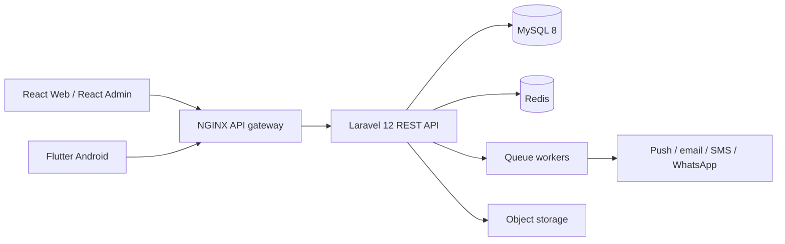

# PETCARE · Portal web

Aplicación web responsive para gestión de mascotas, cuidados sanitarios, agenda y directorio. Está construida con React, TypeScript y Vite, y guarda los datos operativos del usuario en `localStorage` para que las altas y reservas sobrevivan a una recarga.

## Ejecución

```powershell
npm install
npm run dev
```

Para crear el paquete optimizado:

```powershell
npm run build
```

## Capacidades implementadas

- Inicio con indicadores, próximos cuidados y acceso a fichas.
- Gestión de múltiples mascotas: registro y ficha con datos clínicos básicos.
- Historial sanitario y registro de notas/cuidos.
- Calendario sanitario derivado de los recordatorios.
- Agenda: creación y visualización de reservas.
- Directorio de servicios con interfaz preparada para un proveedor de geolocalización.
- Tema oscuro, diseño responsive y persistencia local.

## Arquitectura objetivo para producción



El frontend entregado es el portal de dueños y la base visual reutilizable para los restantes roles. Para completar el sistema distribuido solicitado se requiere provisionar los servicios externos y secretos de cada ambiente: MySQL, Redis, Firebase, Google Maps, proveedores de correo/SMS/WhatsApp y las credenciales OAuth. El equipo local actual no dispone de PHP/Composer ni Flutter, por lo que no es posible compilar ni verificar un backend Laravel o APK/AAB reales desde este entorno.

## Modelo de dominio recomendado

| Dominio | Entidades principales |
| --- | --- |
| Identidad | users, roles, permissions, organizations, invitations |
| Mascotas | pets, pet_members, weight_entries, feeding_plans, allergies |
| Clínica | clinical_records, vaccinations, treatments, prescriptions, attachments |
| Agenda | providers, services, availability_slots, appointments |
| Alertas | care_plans, reminders, notification_logs |
| Directorio | places, place_categories, opening_hours, reviews |
| Auditoría | audit_logs, login_events, exports |

## API REST propuesta

`/api/v1/auth`, `/api/v1/pets`, `/api/v1/pets/{pet}/medical-records`, `/api/v1/pets/{pet}/weights`, `/api/v1/reminders`, `/api/v1/appointments`, `/api/v1/providers`, `/api/v1/directory`, `/api/v1/notifications`.

Cada recurso debe aplicar autorización por rol y pertenencia familiar/organizacional, validación de entrada, paginación, rate limiting y eventos de auditoría. OpenAPI debe publicarse desde Laravel como contrato único para web y Flutter.
